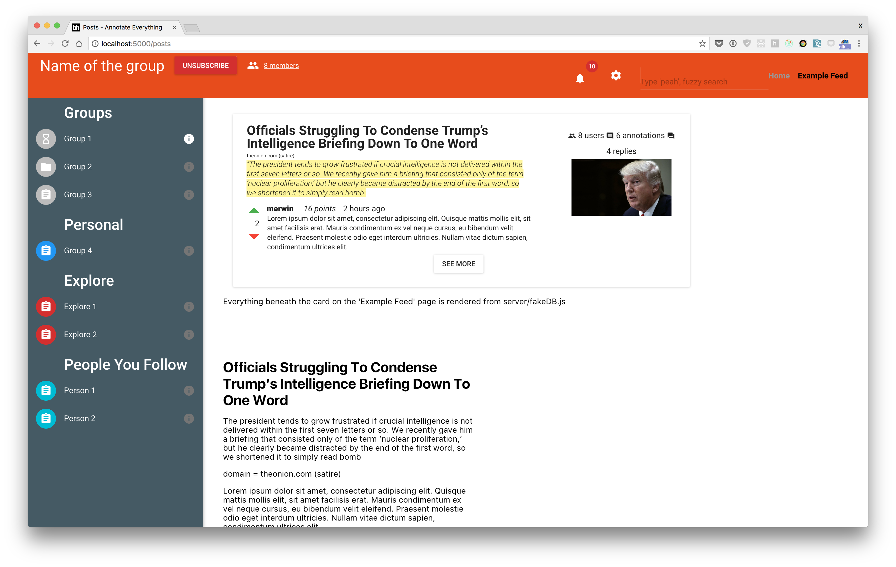
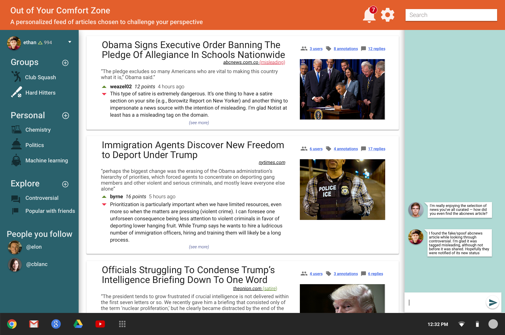

http://notist.herokuapp.com

To run locally:
* go to our cs98 Google Drive folder and download the .env file to your root project directory
* npm install
* npm run dev

Number 1 priority is common/routes/PostList/components/PostListItem

Linter works with airbnb style! Warnings/errors generated from `npm start` are as desired!

- For chat on the right side, just need an empty, collapsible drawer (will later integrate with socket.io)

How to run:
- `npm i`
- `npm start`

